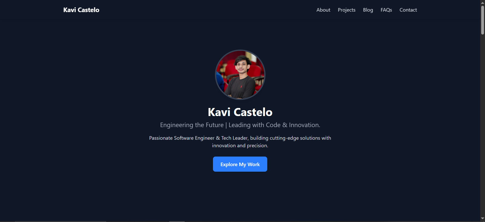

# 🚀 Kavi Castelo - Developer Portfolio

Welcome to my professional portfolio! This project showcases my work, skills, and achievements in the tech industry.

## 🌟 Features

- ⚡ **Blazing Fast** - Built with [Astro](https://astro.build/) for top performance.
- 🎯 **SEO & AEO Optimized** - Fully optimized for search engines and answer engine optimization.
- 📂 **Markdown-Powered Blog & FAQs** - Easily add blog posts and FAQs with Markdown.
- 🔥 **Projects Section** - Dynamically loaded from a JSON file.
- 🌐 **Fully Responsive** - Works seamlessly on all devices.
- 🛠️ **Netlify Deployment** - Hosted on Netlify for smooth and reliable performance.

## 📸 Preview

🔗 **Live Demo:** [kavicastelo-dev.netlify.app](https://kavicastelo-dev.netlify.app/)



## 🏗️ Tech Stack

- **Frontend:** Astro, Tailwind CSS
- **Data Handling:** Markdown, JSON
- **Deployment:** Netlify

## 🚀 Installation & Setup

1. **Clone the repository:**
   ```sh
   git clone https://github.com/kavicastelo/pro-portfolio.git
   cd pro-portfolio
   ```

2. **Install dependencies:**
   ```sh
   npm install
   ```

3. **Run the development server:**
   ```sh
   npm run dev
   ```

4. **Build for production:**
   ```sh
   npm run build
   ```

5. **Deploy to Netlify** (or any static hosting platform).

## 🛠️ Configuration

- **Projects Data:** Modify `src/data/projects.json`.
- **Blog Posts:** Add Markdown files in `src/content/blog/`.
- **FAQs:** Add Markdown files in `src/data/faqs.json`.
- **Social Links:** Edit `src/data/socials.json`.

## 📜 License

This project is open-source under the **MIT License**.

---

💡 Built with passion by **Kavi Castelo** 🚀
